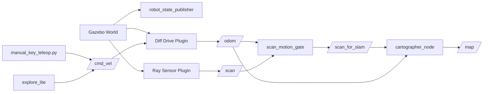

# Radar-and-ROS-Powered-Indoor-Mapping-Robot

ROS 2 Humble simulation project for indoor SLAM using Gazebo Classic, Cartographer, and manual/autonomous operation modes.

## Table of Contents
- Overview
- System Architecture
- Runtime Data Flow
- Active Pipeline
- Project Structure
- Setup
- Runbook
- Validation Checklist
- Troubleshooting
- Notes

## Overview

This project provides a full indoor mapping workflow:
- Spawn differential-drive robot in Gazebo
- Publish sensor/odometry topics
- Build occupancy map with Cartographer
- Support manual and autonomous operation modes
- Save generated map artifacts (`.pgm`, `.yaml`)

## System Architecture



## Runtime Data Flow

Manual mode:
- `manual_key_teleop.py -> /cmd_vel -> diff_drive -> /odom`
- `/scan + /odom (+ scan gate) -> cartographer -> /map`

Auto mode:
- `explore_lite -> /cmd_vel -> diff_drive -> /odom`
- `/scan + /odom -> cartographer -> /map`

Core topics:
- `/cmd_vel`
- `/scan`
- `/scan_for_slam`
- `/odom`
- `/map`
- `/tf`, `/tf_static`

## Active Pipeline

Primary active files:
- `launch/cartographer_mapping.launch.py`
- `launch/auto_explore.launch.py`
- `scripts/manual_key_teleop.py`
- `scripts/scan_motion_gate.py`
- `scripts/save_map.py`
- `config/indoor_bot_lidar_slam_2d_gazebo.lua`
- `models/urdf/indoor_bot_ros2.gazebo`

## Project Structure

```text
.
├── config/                # SLAM and navigation configs
├── launch/                # ROS 2 launch files
├── models/                # Robot and Gazebo model files
├── msg/                   # ROS custom messages
├── rviz/                  # RViz profiles
├── scripts/               # Python nodes/scripts
├── src/                   # Legacy C++ exploration utilities
├── worlds/                # Gazebo worlds
├── CMakeLists.txt
├── package.xml
└── README.md
```

## Setup

```bash
cd /mnt/c/users/deeks/onedrive/documents/radar-and-ros-powered-indoor-mapping-robot
source /opt/ros/humble/setup.bash
colcon build --packages-select indoor_bot
source install/setup.bash
```

## Runbook

### 1) Clean old processes (recommended)

```bash
pkill -f "ros2 launch indoor_bot"
pkill -f "ros2 run indoor_bot"
pkill -f "cartographer|explore|manual_key_teleop|gzserver|gzclient|rviz2"
```

### 2) Manual mode (stable demo mode)

Terminal 1:
```bash
cd /mnt/c/users/deeks/onedrive/documents/radar-and-ros-powered-indoor-mapping-robot
source /opt/ros/humble/setup.bash
source install/setup.bash
ros2 launch indoor_bot cartographer_mapping.launch.py gui:=true rviz:=false require_motion_for_scan:=true
```

Terminal 2:
```bash
cd /mnt/c/users/deeks/onedrive/documents/radar-and-ros-powered-indoor-mapping-robot
source /opt/ros/humble/setup.bash
source install/setup.bash
ros2 service call /unpause_physics std_srvs/srv/Empty '{}'
```

Terminal 3:
```bash
cd /mnt/c/users/deeks/onedrive/documents/radar-and-ros-powered-indoor-mapping-robot
source /opt/ros/humble/setup.bash
source install/setup.bash
python3 scripts/manual_key_teleop.py
```

### 3) RViz

```bash
cd /mnt/c/users/deeks/onedrive/documents/radar-and-ros-powered-indoor-mapping-robot
source /opt/ros/humble/setup.bash
source install/setup.bash
export LIBGL_ALWAYS_SOFTWARE=1
export MESA_GL_VERSION_OVERRIDE=3.3
export MESA_GLSL_VERSION_OVERRIDE=330
rviz2
```

RViz settings:
- Fixed Frame: `map`
- Add `Map` topic `/map`
- Add `LaserScan` topic `/scan`
- Add `TF`
- Add `RobotModel`

### 4) Autonomous mode

Terminal 1:
```bash
cd /mnt/c/users/deeks/onedrive/documents/radar-and-ros-powered-indoor-mapping-robot
source /opt/ros/humble/setup.bash
source ~/explore_ws/install/setup.bash
source install/setup.bash
ros2 launch indoor_bot auto_explore.launch.py gui:=true rviz:=false require_motion_for_scan:=false
```

Terminal 2:
```bash
cd /mnt/c/users/deeks/onedrive/documents/radar-and-ros-powered-indoor-mapping-robot
source /opt/ros/humble/setup.bash
source ~/explore_ws/install/setup.bash
source install/setup.bash
ros2 service call /unpause_physics std_srvs/srv/Empty '{}'
```

### 5) Save map

```bash
cd /mnt/c/users/deeks/onedrive/documents/radar-and-ros-powered-indoor-mapping-robot
source /opt/ros/humble/setup.bash
source install/setup.bash
python3 scripts/save_map.py ./my_map 20
```

Output:
- `my_map.pgm`
- `my_map.yaml`

## Validation Checklist

```bash
ros2 topic info /cmd_vel
ros2 topic hz /scan
ros2 topic hz /scan_for_slam
ros2 topic hz /odom
ros2 topic hz /map
```

Expected:
- Manual mode: robot moves with keyboard
- Auto mode: robot receives motion commands from explorer stack
- Map updates while robot explores

## Troubleshooting

1. `/cmd_vel` publisher count is 0
- Auto mode needs navigation backend available.
- Ensure `explore_lite` is installed/sourced and control stack is running.

2. RViz shader/OpenGL error
- Use software rendering env vars shown in RViz section.

3. DDS shared memory lock errors
- Kill stale ROS/Gazebo processes.
- Clear stale SHM locks:
  - `rm -f /dev/shm/fastrtps_port*`
  - `rm -f /dev/shm/fastdds*`

4. Empty map before movement (manual)
- Expected when `require_motion_for_scan:=true`.
- Map starts after robot movement.

## Notes

- Simulation uses LiDAR sensor model.
- Do not run manual teleop and autonomous motion controllers together.
- Gazebo Classic is EOL; migration to modern Gazebo can be planned later.
